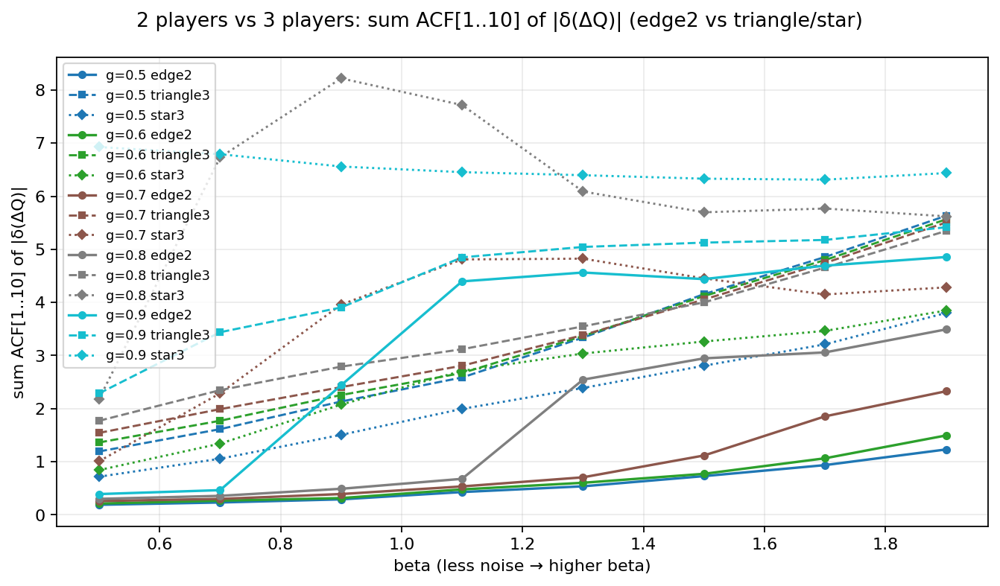
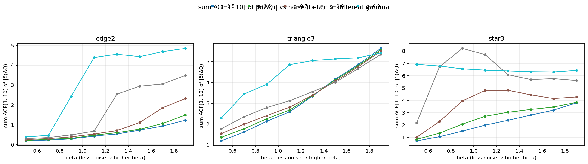
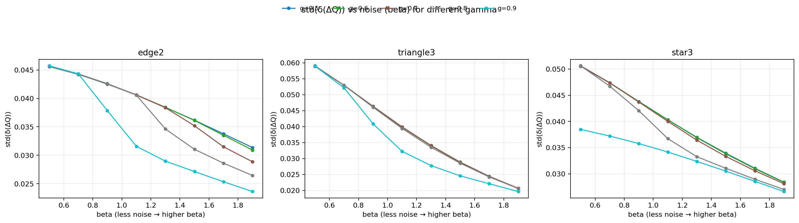
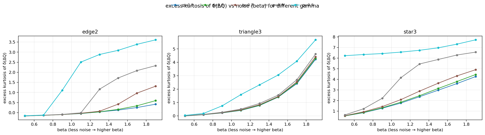
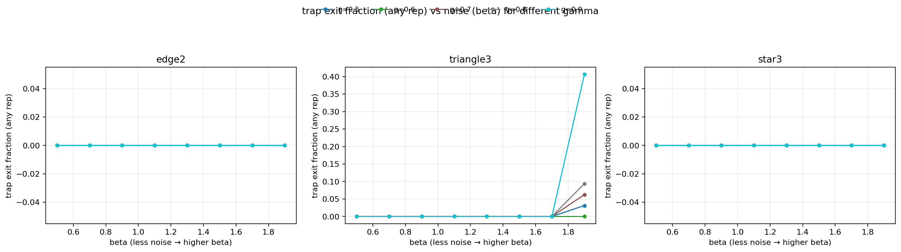
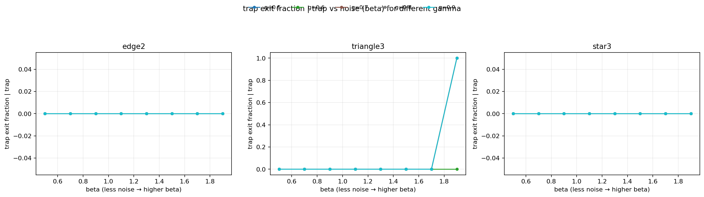

# Выводы по эксперименту trap-effect (run_20260401_203845)

Источник данных: `summary_20260401_203845.json` и PNG-графики в этой папке.

## Конфигурация

- Награды: `reward_type=pp`, benefit-cost: $b=3.0$, $c=1.0$
- Обучение: $\alpha=0.01$, Boltzmann policy с параметром $\beta$ (меньше шума при большем $\beta$), дисконт $\gamma$
- Сетка параметров: $\beta \in \{0.5,0.7,0.9,1.1,1.3,1.5,1.7,1.9\}$, $\gamma \in \{0.5,0.6,0.7,0.8,0.9\}$
- Длина: `num_iterations=100000`, `record_every=10` (запись каждые 10 шагов), `n_replications=32`

Всего конфигураций: 3 топологии × 8 β × 5 γ = **120** запусков.

## Определения метрик (как в коде)

### ΔQ и δ(ΔQ)

- $\Delta Q(t) = Q(C,t) - Q(D,t)$.
- $\delta(\Delta Q)$ — приращения между соседними записанными точками (т.е. на шаге 10 итераций по оси времени).
- `deltaq_inc_stats.*` считаются по массиву формы (replications × agents × time) с последующим “flatten” (агенты/репликации/время вместе).

### “Кластеризация волатильности”

- Ряд волатильности: $v(t)=\mathrm{mean}_{rep,agent}|\delta(\Delta Q)(t)|$.
- Сила кластеризации: `acf_sum_1_to_K = \sum_{\ell=1..K} \mathrm{ACF}(v,\ell)`, здесь $K=10$.

Это прокси-метрика: она показывает, насколько “крупные” изменения Q имеют тенденцию группироваться во времени.

### Ловушка (pure-vs-mixed)

Ловушка фиксируется, если **все** агенты достаточно долго находятся около чистой стратегии (p(C) около 0 или 1), при этом целевая равновесная кооперация задана как смешанная:

- `trap_pure_eps=0.02`
- `trap_eq_p_coop=0.5` (смешанное, так как $0.02 < 0.5 < 0.98$)
- `trap_min_duration=500` итераций ⇒ `trap_min_duration_points=50` записанных точек

Доп. метрики:

- `trap_fraction_any_rep` — доля репликаций, где ловушка была хотя бы раз.
- `trap_exit_fraction_any_rep` — доля репликаций, где ловушка была и затем **вышла** (интервал завершился до конца траектории).
- `trap_exit_fraction_given_trap` — условная доля выходов среди “пойманных”.

## Ключевые результаты

### 1) Топология и число игроков резко усиливают “волатильностную память”

Среднее значение `acf_sum_1_to_K` по всей сетке (β,γ):

- **edge2 (2 игрока):** mean **1.434**, median **0.692**
- **triangle3 (3 игрока):** mean **3.516**, median **3.412**
- **star3 (3 игрока):** mean **4.202**, median **4.054**

Максимум по всем конфигурациям: **8.220** на `star3, γ=0.8, β=0.9`.

График сравнения: 
Сводка по sweep: 

Интерпретация: переход от 2 к 3 игрокам (и особенно star-граф) добавляет режимы взаимодействия и “переключения”, из-за чего $|\delta(\Delta Q)|$ становится более автокоррелированным.

### 2) Уменьшение шума (рост β) почти всегда: меньше шаги, но более “режимная” динамика

По всем топологиям `std(δ(ΔQ))` **сильно убывает** с ростом β (корреляции около −0.99 для каждого фиксированного γ). Это видно и на графиках:

При этом сила кластеризации `acf_sum_1_to_K` в целом **растёт** с β (edge2 и triangle3 — почти монотонно; star3 — более сложное, иногда немонотонное поведение).

Интерпретация: при большом β политика менее шумная, Q-обновления становятся “мелче”, но появляется длительная коррелированная структура (эпизоды почти-стабильности и редкие переключения), что поднимает ACF по $|\delta(\Delta Q)|$.

### 3) Тяжёлые хвосты δ(ΔQ) особенно выражены в star3

Медианная excess kurtosis по сетке:

- edge2: median **0.056** (почти “не тяжёлые хвосты”)
- triangle3: median **0.787**
- star3: median **3.366**

Максимум excess kurtosis: **7.726** на `star3, γ=0.9, β=1.9`.

График sweep: 

Интерпретация: star-граф чаще даёт редкие, но относительно крупные “рывки” в Q (по сравнению с типичным масштабом), что и проявляется в высокой kurtosis.

### 4) Ловушки (pure-vs-mixed) в этой сетке почти отсутствуют; редкие случаи — только triangle3 при максимальном β

Ненулевые значения `trap_fraction_any_rep` обнаружены **только** для triangle3 при $\beta=1.9$:

- triangle3, β=1.9, γ=0.5: trap_any = **0.03125**
- triangle3, β=1.9, γ=0.7: trap_any = **0.0625**
- triangle3, β=1.9, γ=0.8: trap_any = **0.09375**
- triangle3, β=1.9, γ=0.9: trap_any = **0.40625**

Причём во всех этих случаях:

- `trap_exit_fraction_any_rep == trap_fraction_any_rep`
- `trap_exit_fraction_given_trap == 1.0`

То есть зафиксированные ловушки — **транзиентные**: они появляются (достаточно долго держатся), но затем выходят до конца траектории.

Графики:  и 

Интерпретация: при очень низком шуме и высокой дальновидности на triangle3 возможны долгие эпизоды почти-чистой стратегии у всех агентов (несогласованные с “заданным” смешанным ответом $p^*(C)=0.5$), но динамика Q-learning всё же часто “переламывается” и уходит из этого режима.

## Что это говорит о “2 vs 3”

В этой постановке различие проявляется прежде всего не в частоте “ловушек” (они редки), а в структуре динамики обновлений:

- **3 игрока (особенно star3)**: сильная автокорреляция волатильности и тяжёлые хвосты δ(ΔQ) ⇒ много “режимности” и бурстов.
- **2 игрока (edge2)**: динамика более “плавная” (меньше kurtosis и слабее кластеризация), при этом при росте β кластеризация всё равно усиливается.

## Ограничения интерпретации

- `trap_eq_p_coop=0.5` задан константой (не вычисляется из параметров игры в коде). Поэтому “pure-vs-mixed trap” здесь — это проверка согласованности динамики с **выбранным** $p^*(C)$, а не доказательство несоответствия истинному равновесию.
- Метрика кластеризации — прокси через ACF агрегированного ряда $\mathrm{mean}|\delta(\Delta Q)|$; это не полноценная оценка GARCH/ARCH, но хорошо показывает наличие “памяти” в интенсивности изменений.

## Практический следующий шаг (если нужно усилить эффект ловушек)

- Вынести $p^*(C)$ из теории (или оценивать эмпирически) вместо константы 0.5.
- Проверить чувствительность к `trap_min_duration` и `trap_pure_eps` (ловушки могут быть “короче” или “не настолько чистыми”).
- Для star3 попробовать меньшие/большие $\alpha$ (часто влияет на амплитуду бурстов и длительность режимов).
